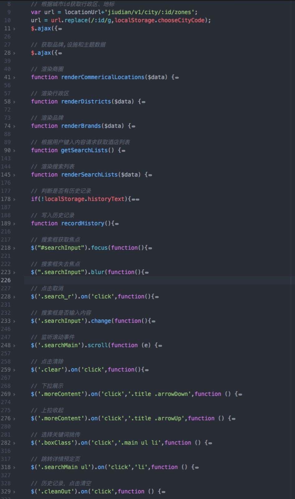
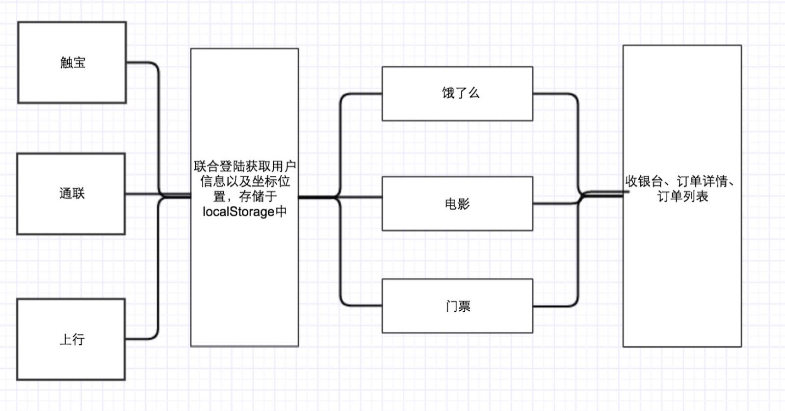

#otoSaas Web App 前端标准

##jQuery

###html:
  1. 头部meta标签：`<meta name="viewport" content="width=device-width, initial-scale=1.0,minimum-scale=1,maximum-scale=1,user-scalable=no”>` 设备1:1禁止用户缩放屏幕。
  2. head中引入css文件，common于业务css前引入。
  3. js在body最后处引入，jquery -> 插件 -> common -> 业务js 。
  4. html代码结构合理，每个模块前注释模块的的作用。
  5. class、id 命名语义化。
  6. 加载时的大菊花统一调用，在页面中添加，common.css中有公共样式。

###css:
  1. font-size 在 common 中统一设在html上，目前规定为16px，页面中所有字体单位为rem。
  2. 目前主体颜色为`rgb(255,154,0)`或`rgb(255,170,0)`。
  3. border-bottom 统一设置：1px solid #f5f5f6。
  4. 页面主体，内边距左右均为16px。
  5. 头部图标16*16
  6. 头部导航栏，height：44px + border-bottom：1px，合高45px，position：fixed；
  7. 主体部分，position：absolute，height根据头部总高度而定，calc（100% - 45px*X个头部栏）。例如右图顶部两个导航栏所以主体高度为`height:calc(100% - 90px)`；
  8. 主体部分，滚动条固定在主体内，不蔓延至其余，凡是滑动部分，为了滑动流畅统一添加属性：  `-webkit-overflow-scrolling: touch;`（但该属性目前发现不少坑，正想办法解决ing）；
  9. 主体部分，每条li之间暂定32px；
  10. 主体部分内，左侧图片距离右侧信息间隔5%；
  11. 主体部分左侧图片，宽高定死92*125，如果ui设计不同，根据实际情况变更；
  12. 主体信息右侧部分，每条信息间隔10px；
  13. 主体信息右侧部分，标题字体为1rem（16px），单行溢出省略或多行溢出省略，一般情况最多不超过两行；
  14. 主体右侧信息部分，副标题或次要信息字体 0.8rem ；
  15. 召唤出各种浮层时背景添加黑色半透明蒙版；阻止背景滚动，阻止的方法有css、js两种，css可以在召唤浮层时给主体设置overflow：hidden；浮层关闭后恢复即可，js方法后面js中补充。
  16. 召唤浮层时注意动画效果，效果例如fadeIn、fadeOut、slideUp、slideDown等，具体实现用css3动画或是js根据实际情况而定。
  17. 通用样式可以设置成class名。
  18. 其余样式根据实际情况而定。

<!-- 

 -->

###js:
  1. 统一调用公共js，目前公共js中的方法正在不断完善中，现有：ajax请求统一本地与线上公共路径、更具URL调取其中的参数，中文也可正常解析、根据时间戳转化为本地时间、2种公共弹窗（凡是逻辑中的弹窗统一调取公共的）、获取当前年月日星期、根据传入的日期获得星期、获取当前农历日期、调取对象的所有key或value（兼容）。具体情况详见common.js
  为不污染全局环境，建议每个页面js封装为每个单独的js对象、或者写成闭包函数，方（kan）便（zhe）调（shu）用（fu）；
  2. js代码逻辑清晰、规范命名、关键是注释！关键是注释！关键是注释！
  3. js中，出现浮层禁止其他内容滚动可以使用touch事件：`$(‘触摸的对象’).on( ‘touch’ , funciton () { return false ) ;`
  4. js中调用动画效果，建议过渡时间定为200ms；

<!--  -->

###Git:
  1. git工具：souceTree、github Desktop、bash
  2. 原则：push之前务必先同步远程库中的最新的代码，避免冲突，尤其是master分支，建议之后逐步完善分支管理。
  3. commit时填写相关信息，方便出问题后及时回滚；

###关于公共页面:
####目前可公用的页面有：
  - 收货地址系列
  - 城市定位
  - 红包优惠
  - 信用卡验证
  - 用户管理（ing）
  - 收银台
  - 订单列表
  - 订单详情

###关于整体流程:
  1. 通过合作方进入页面，
  2. 调用联合登陆获取用户信息以及坐标位置（ing）
  3. 业务逻辑，下单
  4. 下单跳转收银台。

<!--  -->
