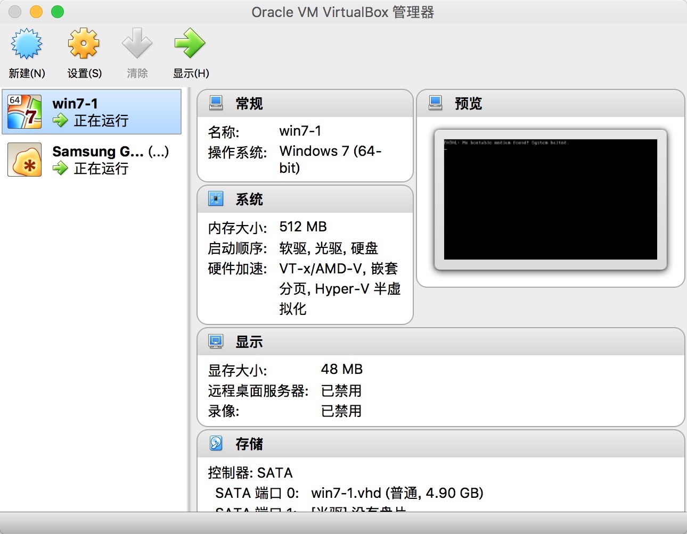
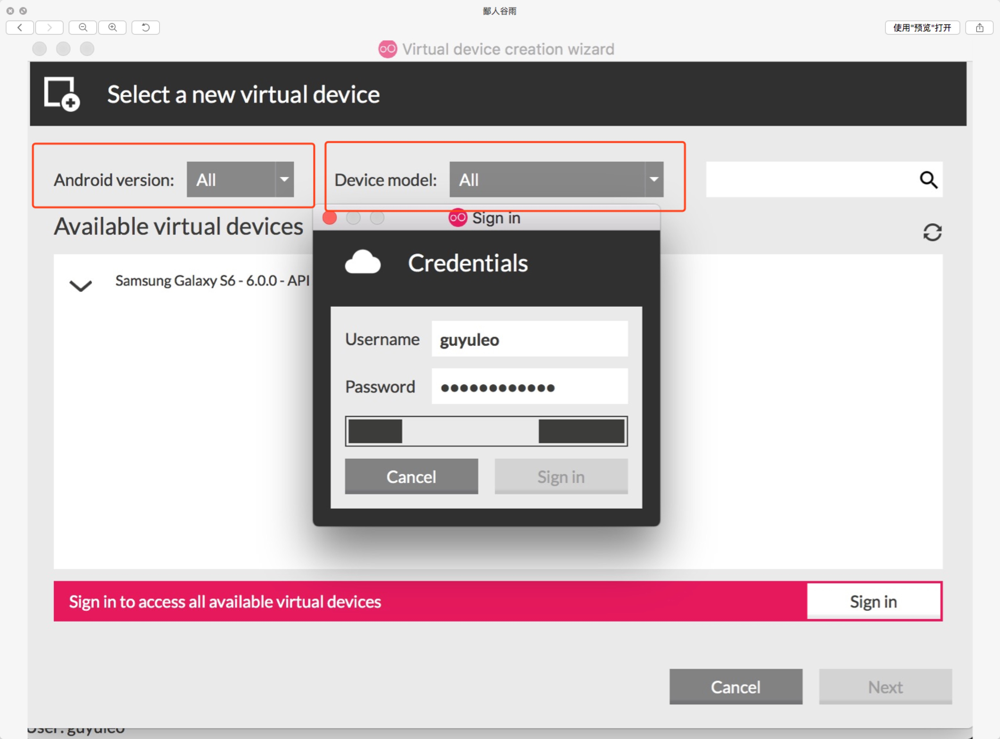
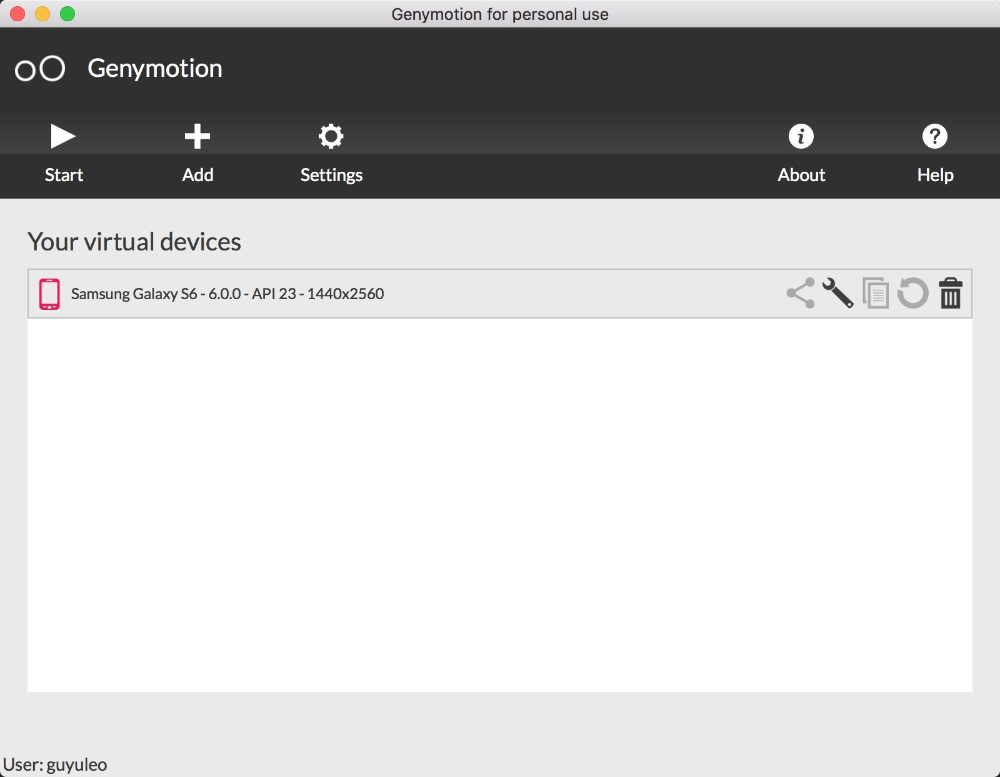
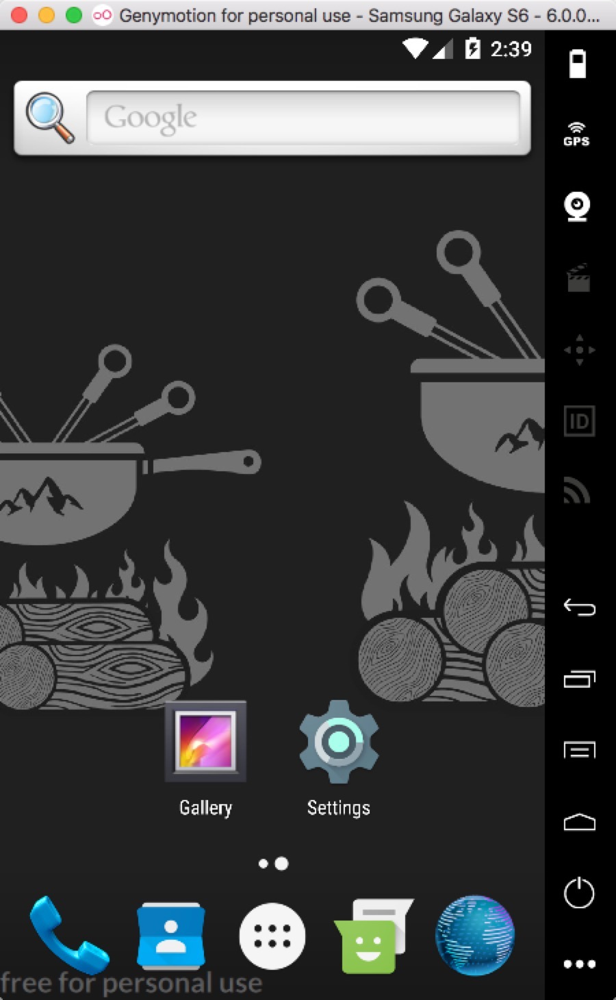
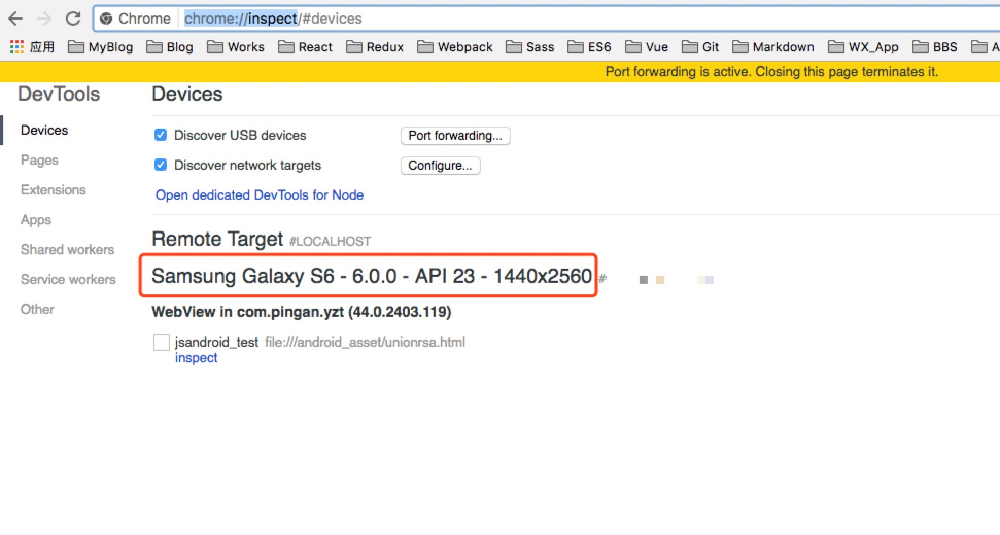
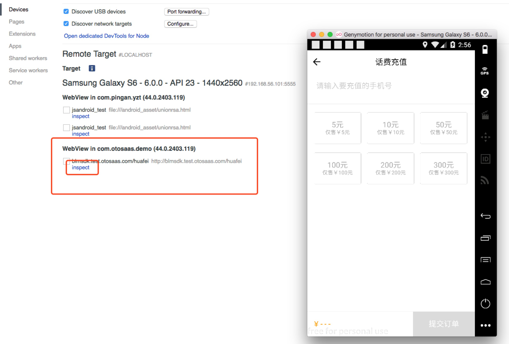
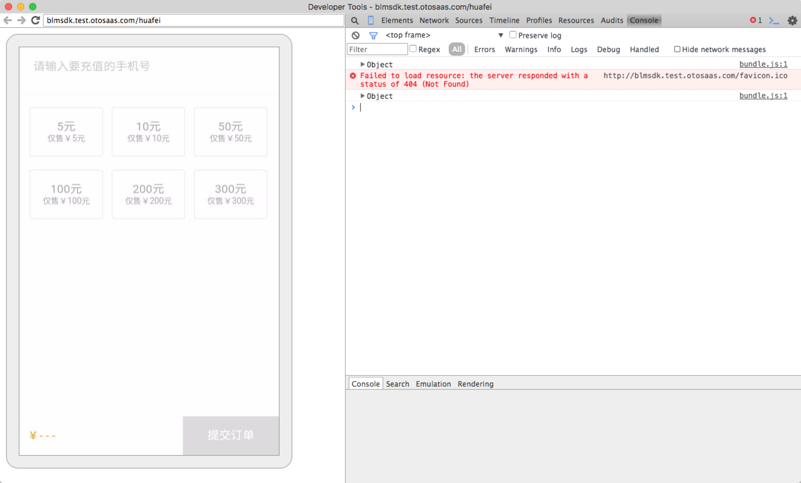

# Webview 调试  --  android

#### 一、初衷

##### 虽然Chrome的移动端模式足以满足我们在开发一些简单的移动端页面的需求，但由于技术栈越发复杂，我们的产品也不再只是简单的随便一个浏览器都能打开运行的页面，更多时候采用的是Hybrid开发方式，在页面上会调用webview注入的函数，举个例子：同一套页面对接不同的客户，植入不同的app，必然会有不同的登陆方式，或调用不同的sdk，或是其他原生方法。但是无论哪种方法都是由webview注入的，所以此时我们是无法在Chrome上进行调试，所以调试的成本就变得非常高昂，有时候为了打个断点，加个alert，都要走一遍打包、上传、发布的流程，而且如果有报错阻塞了整体运行更本就没法知道问题出在了哪里，可谓是非常麻烦，所以痛定思痛之下，收集了些资料，拜读了些文章，做了些尝试，终于可以像是在Chrome上调试基础页面一样方便调试web app了，最后总结了此篇文章。

--
#### 二、调试工具

##### Genymotion、VirtualBox、Chrome

* Genymotion: 这是一款安卓模拟器，可以直接在电脑上开启一个安卓机，机型很多，版本也很全，用起来也还算顺手，可以直接从[官网](https://www.genymotion.com/)下载，必须要注册才可以下载，可以选择个人版本，免费的。相关下载安装可以参考[这篇](https://briian.com/15110/)文章。

* VirtualBox: 虚拟机，运行Genymotion需要虚拟机环境，我起的是一个win7环境，至于为什么用Genymotion需要虚拟机的环境还没有深究过，但是如果不运行虚拟机确实无法运行android模拟器，[下载](https://www.virtualbox.org/)安装都很简单，在此不赘述。

* Chrome：Chrome浏览器，不用多说，必备工具。

--

#### 三、开始调试

##### 1、开启虚拟机，新建配置虚拟机，我这里起的是一个win7的系统，如图：

##### 2、开启Genymotion,第一次打开时需要登陆，就是在官网上注册的账户密码，输入之后就是启动模拟器的界面，我这里建的是一个6.0的炸弹机，可以根据需要自行配置模拟的手机牌子型号和系统版本。

##### 3、新建完成后，双击创建的机型或者点击start就可以直接打开运行模拟器了，这就相当于一个真机，可以安装app，上网，也可以通过Charles，设置代理进行抓包，如果要安装测试app也很简单，直接可以从本地拉到模拟器中就可以自动安装了。

##### 4、打开我们的Chrome浏览器，在地址栏输入 chrome://inspect ,这时候就可以看到我们刚才跑的模拟器就已经在Devices中显示了。

##### 5、这时候我们回到模拟器，点开你要测试的webview，就可以看到我们刚才打开的页面链接已经出现在浏览器中了，这时点击‘inspect’就会弹出开发者模式的界面，我们就可以看到后台有无报错，通过预先留在代码中的flag从而得知程序运行的进度。

#### 四、总结
##### 通过这一套工具我们可以节约不少调试的成本不用动不动就打包发布，通过alert来艰难的进行调试。如有问题，希望给予指正。