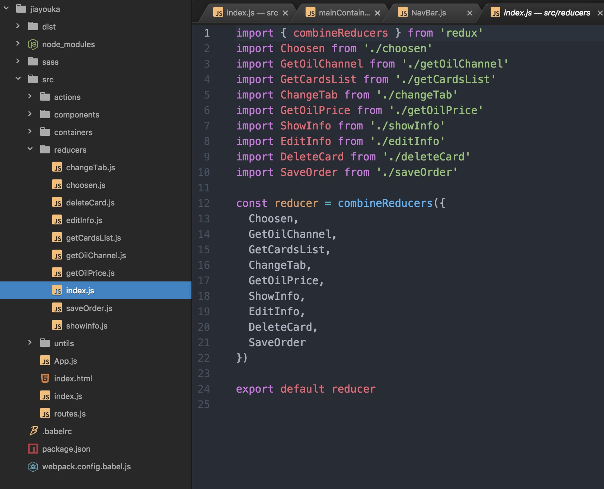

# otoSaas Web App React基础规范（一）

## 一、新技术栈概览

### 1、技术栈：React + ES6 + Redux + Sass + Webpack

### 2、参考资料（中文）：
React：
 [React中文站](http://reactjs.cn/react/docs/getting-started-zh-CN.html)
 [React入门教程]( https://hulufei.gitbooks.io/react-tutorial/content/introduction.html)

ES6：
 [ES5与ES6写法对照表](http://bbs.reactnative.cn/topic/15/react-react-native-%E7%9A%84es5-es6%E5%86%99%E6%B3%95%E5%AF%B9%E7%85%A7%E8%A1%A8)
 [阮一峰ES6教程](http://es6.ruanyifeng.com/)

Redux：
 [基础教程](http://cn.redux.js.org/)
 [Redux核心概念](http://www.jianshu.com/p/3334467e4b32)
 [Awesome Redux英文版但比较全面，star7000+](https://github.com/xgrommx/awesome-redux)

Sass：
 [W3CPLUS基础教程](https://www.w3cplus.com/sassguide/)

Webpack：
 [基础教程](https://hulufei.gitbooks.io/react-tutorial/content/webpack.html)
 [基础教程](http://zhaoda.net/webpack-handbook/configuration.html)
 [较为透彻但稍有难度](http://www.cnblogs.com/vajoy/p/4650467.html)

## 二、项目构建

#### 基础项目结构

一般来说开发环境的各项文件都同一放在  src  文件目录下，dist目录下存放的是经过webpack打包编译后的输出文件目录（包括dist文件）项目发布时只需部署dist文件即可，node_modules下存放的是根据package.json中的dependencies安装的loader，图中的sass目录是一些公共的mixins，可以不添加。.babelrc和webpack.config.babel.js均为配置文件，后文详细说明。

##### 1、建立项目文件夹(如图中jiayouka)，cd命令进入文件夹后，执行命令

`npm init`

创建npm包，并且自动生成  package.json 文件，并且根据个人情况配置该文件，以下是该项目的依赖，可以直接复制粘贴至你的  package.json 文件，然后直接`npm install`安装这些依赖，如果安装依赖时报平行依赖webpack版本过低的错误可以无视，不影响使用。不过之前建议先确认下node和npm的版本，踩到过因为版本过低导致安装依赖一直出问题的情况，而且如果由于版本问题安装依赖失败很难根据报错锁定到原因（因为无论什么报错提示都会说可能是你的npm和node的版本过低），建议node提升至6.9.5，npm提升至3.10.10 亲测目前需要的依赖都可以正常安装。

devDependencies依赖:

	"devDependencies": {
		"@boluome/blm-web-components": "^0.3.16",  
		"@boluome/common-lib": "^1.0.2",  
		"@boluome/oto_saas_web_app_component": "^1.0.3",  
		"antd-mobile": "^0.9.14",  
		"babel-cli": "^6.23.0",  
		"babel-loader": "^6.3.0",  
		"babel-plugin-import": "^1.1.0",  
		"babel-preset-es2015": "^6.22.0",  
		"babel-preset-react": "^6.23.0",  
		"babel-preset-stage-0": "^6.22.0",  
		"css-loader": "^0.26.1",  
		"file-loader": "^0.10.0",  
		"html-webpack-plugin": "^2.28.0",  
		"node-sass": "^4.5.0",  
		"path": "^0.12.7",  
		"postcss-cssnext": "^2.9.0",  
		"postcss-loader": "^1.3.3",  
		"react": "^15.4.2",  
		"react-dom": "^15.4.2",  
		"react-redux": "^5.0.2",  
		"react-router": "^3.0.2",  
		"react-router-loader": "^0.5.4",  
		"redux": "^3.6.0",  
		"redux-thunk": "^2.2.0",  
		"sass-loader": "^6.0.0",  
		"style-loader": "^0.13.1",  
		"url-loader": "^0.5.7",  
		"webpack": "^1.14.0",  
		"webpack-dev-middleware": "^1.6.1",  
		"webpack-dev-server": "^1.16.3"
	}

此项目的 npm 指令，作为参考：  

	"scripts": {
	    "test": "echo \"Error: no test specified\" && exit 1",
	    "demo": "webpack-dev-server --config webpack.config.babel.js ",
	    "build": "NODE_ENV=production webpack --watch --config webpack.config.babel.js -p --progress --hide-modules"
	}
	
##### 本地测试时直接输入命令启动服务：  
`npm run demo`  

##### 打包时直接输入命令：  
`npm run build`  

##### 2、新建并配置Webpack文件，可以直接使用es6配置，文件名为  webpack.config.babel.js，而ES5的配置文件名为 webpack.config.js ，entry和output配置根据项目实际情况而定，以下是此项目的entry和output
	
	entry: {
		'app': SRC_PATH,
    	'vendor': ['react', 'react-dom', 'react-router', 'react-redux', 'redux']
	},
	output: {
		path         : '__dirname/dist/jiayouka',
		filename     : 'bundle.js?[hash]',
		chunkFilename: '[name].chunk.js?[hash]',
		publicPath   : '/jiayouka'
	},
	
该项目的loaders配置（有关loader的基本概念在此不赘述）有问题的可以看[这里](https://hulufei.gitbooks.io/react-tutorial/content/webpack.html)

    loaders: [
      {
        test: /\.jsx?$/,
        loader: 'babel',
        include: [ SRC_PATH , MODULE_PATH ]
      },
      {
        test: /\.(css|scss|sass)$/,
        loaders: ['style', 'css', 'postcss', 'sass'],
        include: [ SRC_PATH , MODULE_PATH ]
      },
      {
        test: /\.(png|jpg|gif|svg)$/,
        include: [ SRC_PATH , MODULE_PATH ],
        loader: 'url',
        query : {
          limit: 10000,
          name : '[name].[ext]?[hash]'
        }
      },
      {
        test: /\.(eot|svg|ttf|woff|woff2)$/,
        loader: "file" ,
        include: [ SRC_PATH , MODULE_PATH ]
      }
    ]
    
该项目的plugins配置，htmlWebpackPlugin指定一个现有的HTML，template的值就是该HTML的路径，而path.resolve()方法是将相对路径转为绝对路径。inject有四个值，当值是true、'body'时所有的js资源都被注入至<body>底部，当值为'head'时，资源会被注入至head底部,当值为false时，资源不会自动注入HTML。**注意！：true和false为布尔值body以及head为字符串**。webpack.optimize.CommonsChunkPlugin用于提取代码中的公共模块，然后将公共模块打包到一个独立的文件中去，以便在其它的入口和模块中使用。

	import webpack from 'webpack'
	import htmlWebpackPlugin from 'html-webpack-plugin'
	
	plugins: [
	    new htmlWebpackPlugin({
	      template: path.resolve(SRC_PATH, 'index.html'),
	      inject  : true
	    }),
	    new webpack.optimize.CommonsChunkPlugin('vendor', 'vendor.bundle.js?[hash]')
    ]
    

服务器配置

	const bProdEnv = process.env.NODE_ENV === 'online'
	
	if(!bProdEnv) {
	  config.devServer = {
	    hot: true,
	    inline: true,
	    historyApiFallback: true,
	    port: '9000',
	    host: '0.0.0.0'
	  }
	  config.plugins = config.plugins.concat([
	    new webpack.HotModuleReplacementPlugin()
	  ])
	} else {
	  config.plugins = config.plugins.concat([
	    new webpack.DefinePlugin({
	      'process.env': {
	        NODE_ENV: JSON.stringify('production')
	      }
	    }),
	    new webpack.optimize.UglifyJsPlugin({
	      compress: {
	        warnings: false
	      }
	    })
	  ])
	}
	
##### 3、新建并配置babel文件，用于将ES6转换为浏览器支持的ES5，从而在现有环境执行，所以需要配置.babelrc文件，该文件存放在项目的根目录下。使用Babel的第一步，就是配置这个文件，具体可以参考以下配置，或参考[babel入门](http://www.ruanyifeng.com/blog/2016/01/babel.html)

	{
	  "plugins" : [
	    ["import", {"style": "css", "libraryName": "antd-mobile"}]
	  ],
	  "presets": [ "es2015", "stage-0", "react" ]
	}
	
##### 4、src文件目录，使用redux管理数据的情况下，src下的文件结构一级目录为  action、container、reducer  再加  React  的  component  文件夹，建议把  css  和  img  全部统一存放，方便管理，如果每个组件新建一个文件夹然后其中在包括组件文件、css文件、img文件，管理起来非常吃力，untils文件夹存放的是一些封装可直接调用的方法，可选择添加。

##三、src目录详解

前文提到过，src为开发目录，所有的开发工作均在该目录下完成，开发完成后经由webpack打包生成dist目录，所有编译打包后的代码均在dist目录下，部署项目时只需上传dist目录下的项目目录即可，例如下图中的jiayouka文件夹，接着就来详细说一下src目录下各个目录的的关系与作用。

#### 1、action目录：action目录下存放若干个项目的action，再讲action目录前要先明白如果单纯使用React是无需Action目录的，因为action是Redux的概念，action的作用是把数据从view（或者请求来的数据或是用户输入的数据）传到store的有效载体，它是store数据的「唯一」来源。一般会通过 `store.dispatch()` 方法将action传到store，如下图中，将通过请求获取到的数据dispatch到store中，以供再页面中渲染， ``type`` 属性是必须的，它相对应了reducer中的 `action.type` ，从而对数据进行进一步处理。其他的属性根据情况而定。

#### 2、reducer目录：reduce 根据 action 预处理过后 dispatch 的对象以 action.type 找到对应的 reducer 从而进行下一步的数据处理，最后再将根据接受来的 state 与 action 处理后的最新的 state ，return出去，最后存储到store中，举个例子，store是一颗存储数据的数据树，那么 reducer 下的 index 就是树干，而其他的 reducer 就是各个存储不同数据的树枝，每个单独的reducer在最后 `export default xxxxx` 出去，再在index中import进来，从而进行连接，这么做的目的是为了避免随着web应用的越发复杂导致 state 对象的树形结构变的越来越深

##### 在上图index最后export了reducer，将所有的reducer集中到了一起，并且将其暴露了出来，方便我们之后 creatStore ，如下图所示先将 reducer 引入，然后通过 redux 的createStore方法创建store，最后在调用react-redux的`<Provider store>` 使组件层级中的 connect() 方法都能够获得 Redux store，并且将根组件嵌套在<Provider>中。

#### 3、components目录：组件目录，里面存放的主要就是应用的各个组件,整个应用就是根据功能拆分的若干个小的组件构成的，这就是目前前端最火的组件化的概念，方便维护和重复使用，下图中的每个红框中的内容就都是一个单独的组件，类似头部、底部的复用率就很高，这样在以后需要的时候就无需多次开发，直接调用这个组件就可以了，很大的降低开发成本

##### 如上图，Home组件中包含了两个子组件，分别是`<TopBar />` `<NavBar />` 它们都由一个 `
` 包裹盛放于Home组件中，而这两个子组件都是另外引入的，而在这两个子组件的js中，最后经由 `export default TopBar` 方法暴露出去，从而使得其他组件得以调用。但如果仔细看第一张图的时候就可注意到两个子组件引入时还是有些差别的，第一个 `<TopBar />` 是在同级目录下的，而 `<NavBar />` 却是在上级目录的containers目录下的，之前提到过组件都是放在components目录下的，为什么这个却是不同，要解释这个问题，那就必须要讲下containers目录了。

#### 4、containers目录：简言之container的作用就是将store中的state赋予 `component` 中的某个组件，这样就解决了各个组件之间的数据传递问题，不用像之前父组件传递子组件中的某个子组件需要一层一层传递下去，当你的组件越深，数据之间的传递就越发的麻烦，更不要说子组件传递数据到父组件或者父组件的平级组件或者更加复杂的关系，如下面的这些代码，调用connect方法将需要的数据直接和 `<NavBar>` 组件连接在一起，并且连接操作不会改变原来的组件而是返回一个新的已与store连接组件类，这时的 `<NavBar>` 组件就不仅有了原本的页面结构更具备了渲染所需要的数据结构，所以这就是为什么上上张图调用的是containers目录下的NavBar组件，因为只有这个组件是连接store的，而component中的只有页面结构。关于connect方法感兴趣的可以在[这里](http://cn.redux.js.org/docs/react-redux/api.html)查看详情。

	import NavBar                   from '../components/navBar'
	import { connect }              from 'react-redux'
	import { login }                from '../untils/login'
	import { fetchOilChannel }      from '../actions/getOilChannel'
	import { fetchCardsList }       from '../actions/getCardsList'
	import { ChangeTab , ShowInfo } from '../actions'

	const mapStateToProps = (state) => {
	  const { GetOilChannel , GetCardsList , GetOilPrice , ShowInfo } = state
	  return {
	    GetOilChannel,
	    GetCardsList,
	    GetOilPrice,
	    ShowInfo
	  }
	}
	
	const mapDispatchToProps = dispatch => {
	  return {
	    handleChange: categoryId => {
	      dispatch(ChangeTab(categoryId))
	      dispatch(ShowInfo(''))
	      dispatch(fetchCardsList({customerUserId: getStore('customerUserId', 'session'), categoryId: categoryId}))
	    }
	  }
	}
	
	export default connect(mapStateToProps, mapDispatchToProps)(NavBar)

### 总结：这篇文章主要以整个项目构建的角度入手，通过配置文件的基础配置和基于开发环境目录的各项文件入手，较为基础具体的分析了单纯的react和利用Redux管理数据流的开发差别和好处，如果有问题，欢迎讨论指正。