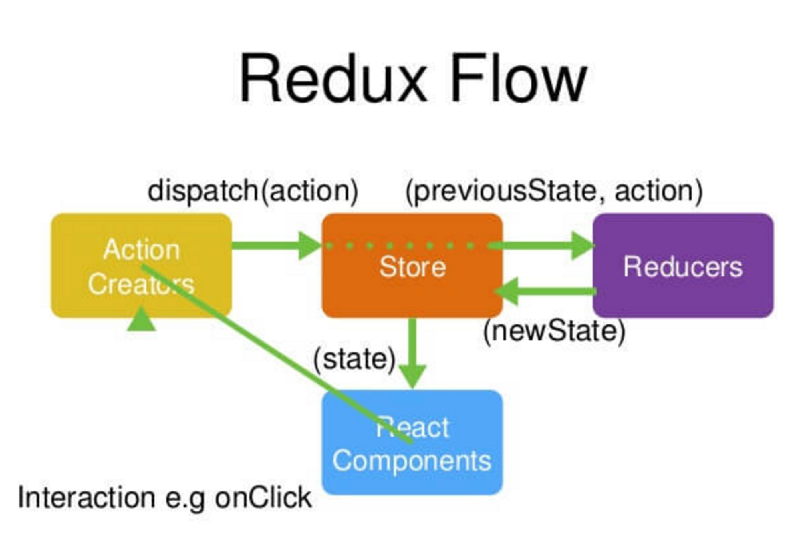

#react+redux开发记录
------------------

###开发技术栈
	react
	redux
	webpack
	antd-mobile
	es6
	sass

###学习资源推荐
1. [Hello World --React](https://facebook.github.io/react/docs/hello-world.html)
2. [es6/es2015 核心内容](http://www.jianshu.com/p/ebfeb687eb70?utm_campaign=hugo&utm_medium=reader_share&utm_content=note&utm_source=qq)
3. [前端之 Sass/Scss 实战笔记](http://url.cn/45mI7ZJ)
4. [Redux 中文文档](http://cn.redux.js.org/index.html)
5. [ANT DESIGN MOBILE](https://mobile.ant.design/components/drawer/)
6. [Webpack的全面介绍，模块Bundler](http://www.theodo.fr/blog/2016/07/a-comprehensive-introduction-to-webpack-the-module-bundler/?utm_source=webpack_official_documentation)
7. [其他相关资源推荐](http://www.jianshu.com/p/a1790e1945a8?utm_campaign=hugo&utm_medium=reader_share&utm_content=note&utm_source=qq)

###开发环境的搭建
   SourceTree添加远端仓库oto_saas_web_app_rebuild，新建一个develop分支。  
	相关终端操作：
	
	/* 根据package.json文件安装依赖 */
	$ npm i
	
	/* install命令之前，登陆npm账号，如果已登陆，请忽略 */
	$ npm login
	
	/* 生成shenghuojiaofei相关文件夹 */
	$ node creator.js shenghuojiaofei
	
	/* 本地开发，默认端口：localhost:9000 */
	$ npm run shenghuojiaofei
	/* 本地开发，自定义端口：localhost:20000 */
	$ npm run shenghuojiaofei 20000
	
	/* 生成静态资源，用于生产 */
	$ npm run shenghuojiaofei_build
    
###目录结构

    |-- assets                                 // 存放html
    |-- config                                 // webpack配置
    |   |-- _                                  // 抽离出来的webpack配置文件
    |   |-- shenghuojiaofei                    //个人项目webpack配置（node create.js shenghuojiaofei自动生成）
    |-- dist                                   // build后静态资源
    |-- src                                    // 项目开发目录
    |   |-- services                           // 重构的所有项目
    |   |   |-- shenghuojiaofe                 // 单个项目(node create.js shenghuojiaofei自动生成）
    |   |   |   |-- actions                    // 存放redux中的action模块
    |   |   |   |   |-- index.js      	       // 例：首页action
    |   |   |   |-- components                 // 显示组件
    |   |   |   |   |-- index.js      	       // 例：首页显示组件
    |   |   |   |-- containers                 // 容器组件
    |   |   |   |   |-- index.js               // 例：首页容器组件
    |   |   |   |-- reducers                   // 存放redux中的reducers模块
    |   |   |   |   |-- index.js               // 例：页面的reducers树
    |   |   |   |   |-- myServices.js          // reducers树的myServices分枝
    |   |   |   |-- styles                     // 存放当前项目所用到的样式
    |   |   |   |   |-- index.scss             // 例：首页样式
    |   |   |   |-- index.js                   // 当前项目入口配置文件
    |   |   |   |-- img                        // 所有项目用到的图片文件scss文件
    |   |   |   |-- index.scss                     
    |-- .babelrc                               // babel文件配置
    |-- .gitignore                             // push忽略文件
    |-- package.json                           // 依赖及配置记录文件
    |-- README                                 // 简介
    |-- path.config.js                         // webpack的配置文件

###react必备技能参考
	了解基础的jsx语法，和样式写法，以及react的函数和es6类声明这两种组件的定义方法。
	
###redux自我小结（个人小结，仅供参考）
	参照redux官方文档，结合里面的demo去熟悉redux管理数据的思想。
     redux的出现，是为了解决react中组件过多时，组件状态之间会互相影响，导致数据不好控制，并且后期添加新需求时的复杂性也很大。  
     redux基于单向数据流的设计思想：所有的数据都被放倒一个store（状态树）中进行管理，只能通过action来发送改变store中的某个state的信号，最后通过自定义的纯函数reducer，来将新的state浅合并到store树中，store树感受到某个分枝上的的数据较之前的数据有更新后，就会更新这个state所在的组件，并将组件重新渲染到浏览器中。
>一个比较有意思的比喻：  
     把 js 比喻成巴士，把 store, container, reducer 比喻为三个车站，再把 state 和 action 比喻成两种乘客。这是一趟环路巴士：  
     1. js巴士 从 store车站 出发，载上 state乘客 ，state乘客 到达某个 container车站 下车并把自己展示出来  
     2. 过了一会，有一个 action乘客 上车了，js巴士 把 action乘客 送到 reducer车站，在这里 action乘客 和 state乘客 生了一个孩子 new state，js巴士把 new state 送回了 store车站（好像是人生轮回→_→）

###redux工作的四大模块

      
*__container模块的职责：__*   
     container中，从store中拿数据，为组件添加属性和方法，使用connect方法，一般的格式是 export default connect(mapStateToProps, mapDispatchToProps)(wrap(mapFuncToComponent)(App))。  
     mapStateToProps作为connect函数的第一个参数，其对应的函数中的第一个参数代表的就是当前store中的state数据，所以在mapStateToProps对应的方法中为组件添加属性，该方法只在组件初次刷新时刷新一次。  
     mapDispatchToProps作为connect函数的第二个参数，其对应的函数的第一个参数代表的是dispatch函数，所以都是在mapDispatchToProps对应的方法中为组件添加方法，通常都是在这个mapDispatchToProps中定义的方法里来执行dispatch操作，mapDispatchToProps方法每次组件刷新时都会刷新一次。  
     wrap是自定义个一个函数方法，用来为组件添加生命周期并返回一个新的组件。wrap方法有时并不写出来，只有当组件需要前置数据时，才会把componentWillMount这个生命周期通过wrap的方法来注入到组件中。  
      
*__action模块的职责：__*  
     action中一般都是定义actionCreator和ajax操作，action是一个对象，一般设置两个键值对，第一个是type名，用来方便reducer判断将数据合并到那个reducer分枝上，第二个是将要改变的state数据 。  
      
*__reducer模块的职责：__*   
     将action中的type外的所有数据全部浅合并到store树上，这里是用了自己封装的一个函数方法setState，该方法的作用是去除action中的type键值对，把剩余的所有建值对全部合并到store和当前reducer对应的state分枝上。  
      
*__store模块的职责：__*  
     所有组件的数据来源，组件更新的控制源，当store的某个state分枝发生改变以后，就会向对应的container发送指令，然后container就会更新他从store中拿的数据，然后使用这些数据的子组件也会更新这些数据。（组件中只有state改变，才会引起组件的刷新，同时组件刷新以后，子组件也会跟着刷新，组件的刷新的同时props属性也会重新获取。）  

###antd组件库使用过程中的“坑”
     *__1. 部分样式布局突然失效__*  
     有可能是antd库的版本升级了，回退的上一版本测试一下。  
      
     *__2. 表单组件的使用__*  
     因为react中的表单组件都是受控的，只有组件的state才能改变表单的value属性，所以如果想要操作表单组件的value属性，就要使用es6声明类的方法创建一个组件，这样就可以使用组件的生命周期了，通过在constructor中声明一个state，在表单中的value属性的值使用这个state，然后在生命周期里定义setState去改变组件的state，来改变表单的value值。  
      
     *__3. iphone6plus上样式错乱__*  
     由于首页引入的高清组件方案中的设置，3dpr的机型对应的html的font-size值也相应改变到了150px，但是因为很多组件在设置时使用的是px单位，这样的话，根节点的font-size值改变并不会改变这些px单位对应的宽高大小等，所以我们需要在webpack中引入一个postcss的插件，结合postcss-pxtorem插件，来讲所有以来的css，scss格式的文件中的px值改变成对应的rem值。这样就解决了上述问题。  
      
     *__4，Tabs组件__*  
     低版本的Tabs方法中，可能没有可视区最多显示5个标签，点击两侧的标签后，滑动tabs的功能，把antd-mobile的版本升级到最新即可（注意，版本升级以后，可能以前的部分样式会改变，及时自行检查一遍自己的页面样式有没有变化）
