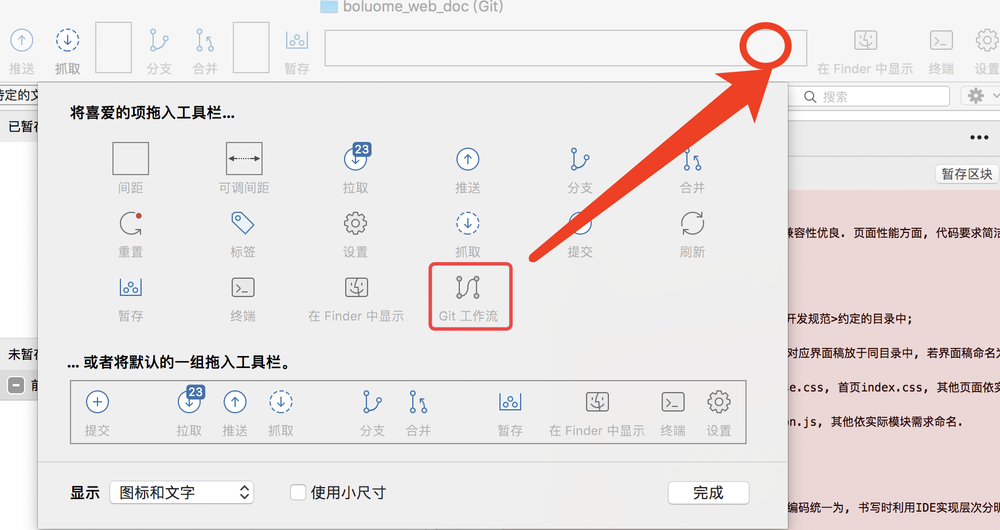

# git flow

### 概念
&emsp; git flow是基于git易于分支和合并的特点设计出来的一个项目开发模型，通过这个模型，我们可以很明确的完成项目的开发、发布、部署和bug修复。
>&emsp; git flow建议使用工具SourceTree，因为SorceTree天然支持git flow，工具栏上就有对应的图标，如果没有，那么根据下图提示操作即可，在圆圈位置处右击，然后选择git flow图标拖到工具栏处即可*
 

### git flow的初始化
&emsp; 第一次使用git flow会有一个初始化设置，选择默认的即可。

### git flow中的分支定义
&emsp; 从上图也可以看到，git-flow中将git的分支分成五大分支: **master**, **develop**, **feature**, **release**, **hotfix**。
&emsp; 其中，master，develop分支属于永久性分支，我们之后的整个开发过程都会围绕着这两个分支进行操作，但是我们是不会直接在里面编写代码，这两个分支中的代码一般都是在通过其他分支合并过来的。其中develop分支不是是git flow初始化后自动生成的。
&emsp; feature, release, hotfix这三个分支属于短期分支，一般在完成对应的功能并合并到对应分枝上后就会被删除。这三种分支刚好对应一个项目的 *开发*，*测试*，*线上*  这三个阶段中， 对master和develop分支中代码进行改变的要求。

### feature, release, hotfix所担当的角色

##### &emsp; feature（ 中文：功能 ）
&emsp; feature分支主要用于项目的功能开发，在正常开发过程中，往往都是多人协调开发，每人负责一个功能或是模块，这时，就要在develop分支上派生出一个feature分支，来开发单个功能。等到开发完成之后，再合并到develop分支上。因为feature分支并不涉及到版本问题，所以命名时比较随意，描述清楚所开发的功能就行。feature分支的开发是为了release分支的创建作准备的。
##### &emsp; release（ 中文：发布 ）
&emsp; release分支主要用于项目的发布，等到功能开发完毕之后，就需要准备发布了，这是就需要创建一个release分支，用于测试阶段，当测试通过以后，就把这个分支合并到master和develop分支上面。合并完之后再推到github上，如果使用了自动发布工具如daocloud，那么代码就会自动发布到服务中。这样就完成了项目的发布工作。注意，这里因为release分支是做为发布的版本，所以**release分支在命名时要遵循版本命名规则**。
##### &emsp; hotfix（ 中文：补丁 ）
&emsp; hotfix分支主要用于线上环境突然出现bug了，用于紧急修复bug来使用的，常常被称作为打补丁。

### feature, release, hotfix的派生，合并

##### &emsp; feature（ 中文：功能 ）
&emsp; feature分支主要用于项目的功能开发，它派生于develop分支，合并至develop分支上。
##### &emsp; release（ 中文：发布 ）
&emsp; 派生于develop分支，合并至develop分支和master分支
##### &emsp; hotfix（ 中文：补丁 ）
&emsp; 派生于master分支，合并至develop分支和master分支
